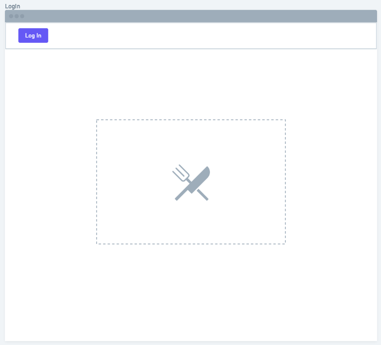
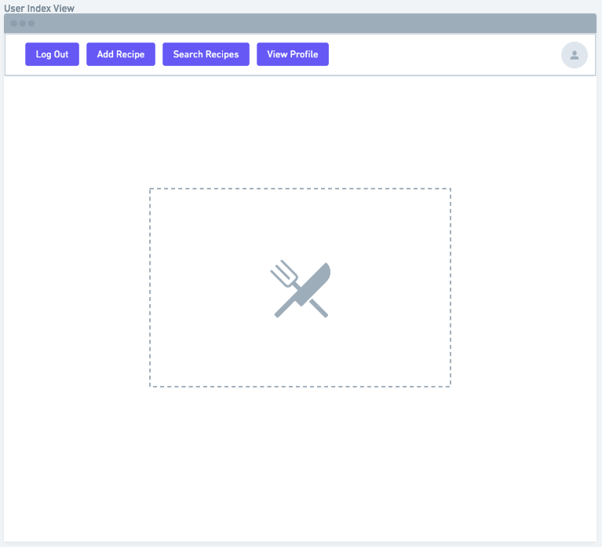
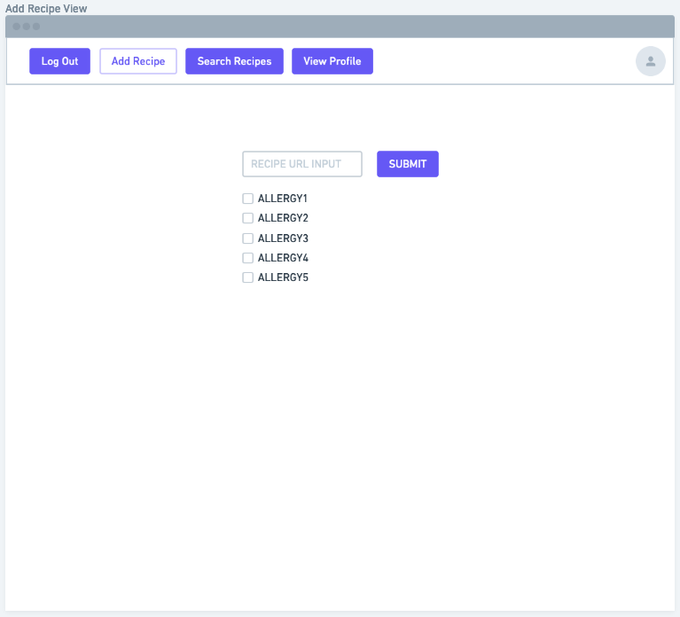
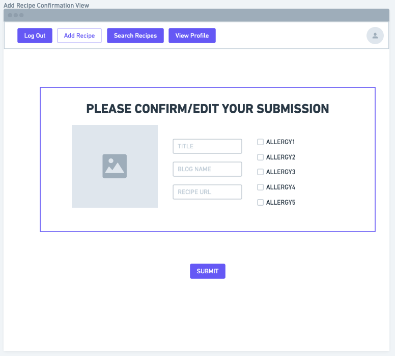
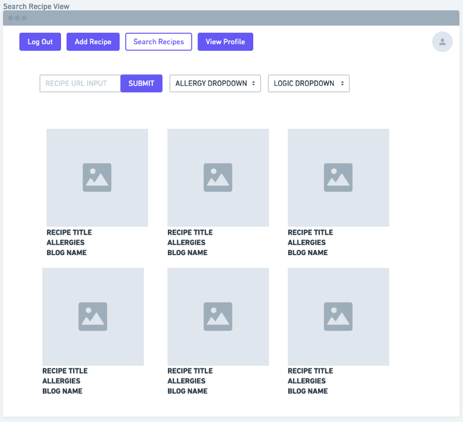
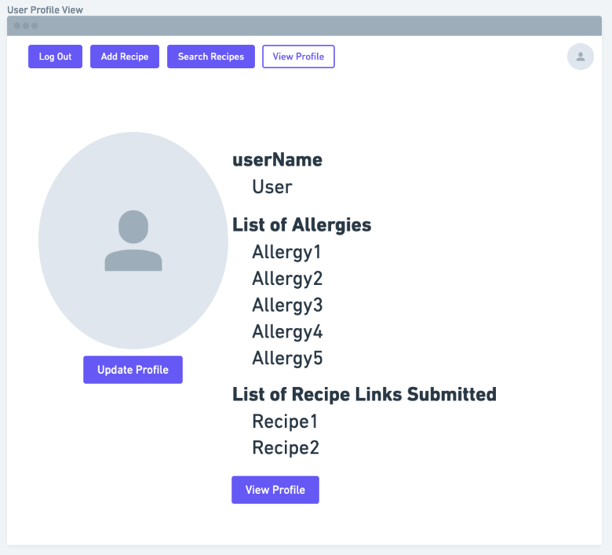
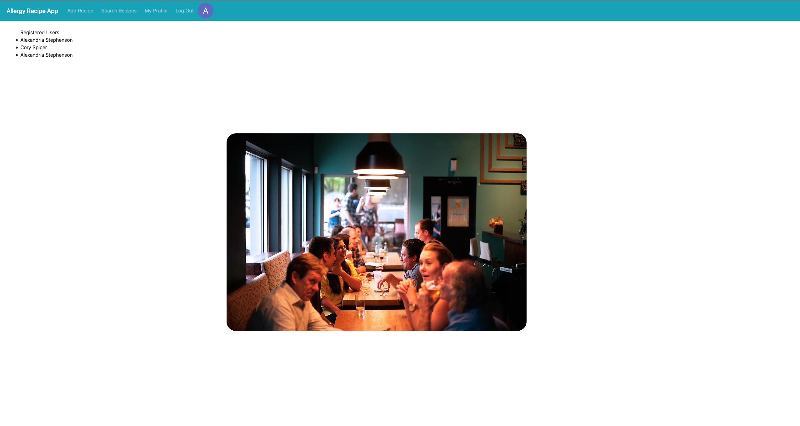
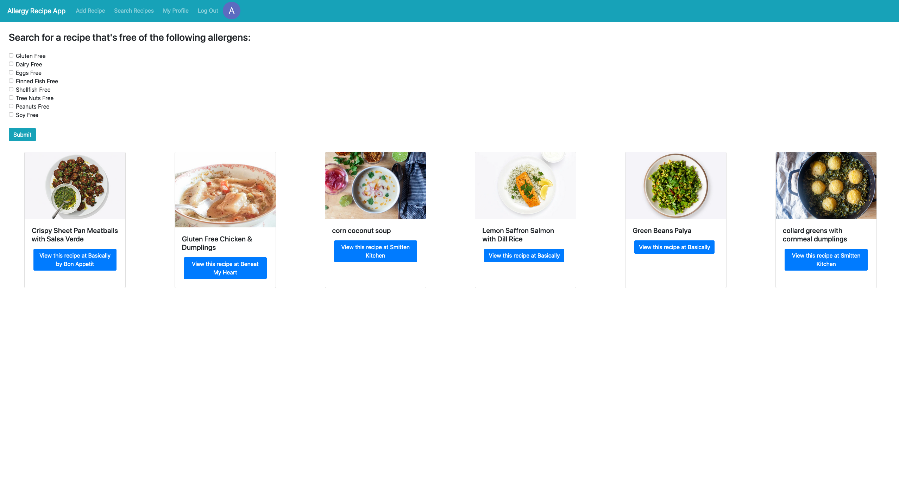
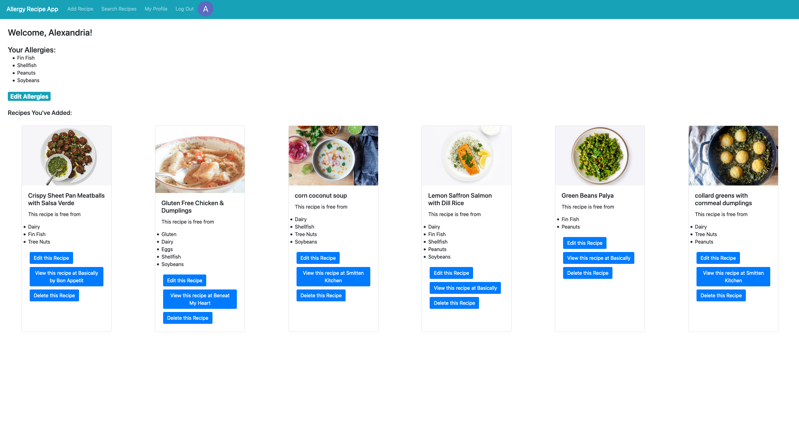

# Allergy Recipe App

## Heroku Link:
[Allergy Recipe App](allergy-recipe-app.heroku.com)

## Trello Link - including User Stories:
[Trello Link](https://trello.com/b/cPF2zOA0/unit-2-project)

## ERD:
[ERD](public/Unit2RecipeERD.png)

## Wireframes:
Login View 
 
User Index View 
 
Add Recipe View 
 
Add Recipe Confirmation View 
 
Search Recipe View 
 
User Profile View 

## Screenshots
Landing Page 
 
Search Page 
 
Profile Page 

## Technologies Used
* NodeJS
* HTML
* CSS
* Express
* Express Generator
* MongoDB
* MongooseJS
* MongoDB Atlas
* EJS Templating
* Heroku with NodeJS
* Google OAuth 2.0
* Passport JS
  
## Next Steps
* I plan to flesh out the allergy schema a bit. I hope to create a dynamic schema that can be updated by any user of the app. 
* I plan to implement a "Friend" functionality, so that you can search for recipes that match your friends' dietary needs. 
