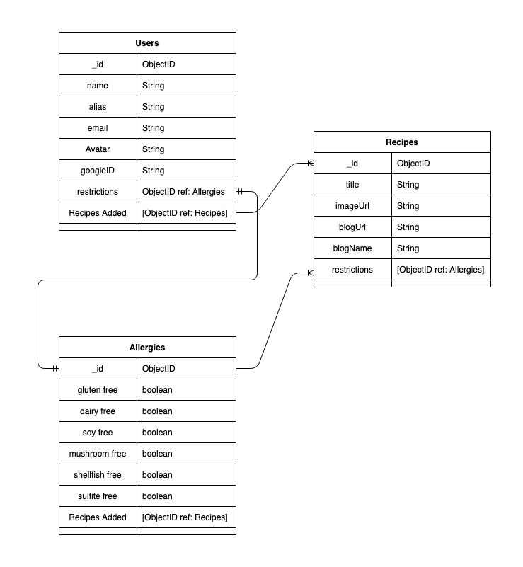

# Allergy Recipe App

## Heroku Link:
!(Allergy Recipe App)[allergy-recipe-app.heroku.com]

## User Stories:
[Trello Link](https://trello.com/b/cPF2zOA0/unit-2-project)

## ERD:

## Wireframes:

## Attributions

## Screenshots

## Technologies Used
* NodeJS
* HTML
* CSS
* Express
* Express Generator
* MongoDB
* MongooseJS
* MongoDB Atlas
* EJS Templating
* Heroku with NodeJS
* Google OAuth 2.0
* Passport JS
* 

